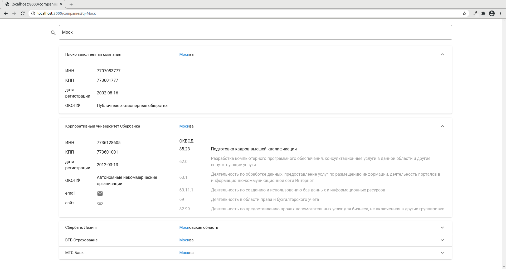

# Задание
Необходимо создать страницу поиска:

Вам предоставлен полностью настроенный проект с бэкэндом на django & sqlLite и фронтэндом на webpack & vue.

В нём заранее подключены djangorestframework, axios, vuex, vuetify (+ [material design icons](https://pictogrammers.github.io/@mdi/font/5.4.55/)), vue-router.  
Использование этих инструментов - опционально. Если вам проще / быстрее выполнить задание без них - делайте без них.

Если какие-то пункты вызывают затруднения - пропускайте их (отметив это в решении).

Если нашли ошибки в проекте - исправьте их :)

# Критерии оценивания

1. аккуратность кода *(организация проекта, DRY, читаемость и т.д.)*
1. соответствие функциональным требованиям
1. commit-сообщения

# Функциональные требования

1. Доработать карточку компании
    1. добавить связь с ОКВЭД
        - одной компании может соответствовать несколько ОКВЭДов
        - одному ОКВЭДу может соответствовать несколько компаний
        - у каждой компании какой-то один из ОКВЭДов является основным
    1. добавить автоматически генерируемые поля
        - дату создания карточки (create_time)
        - дату изменения карточки (update_time)
2. Настроить в django панель администратора
    1. подключить все модели проекта
        - Регион
        - ОКОПФ
        - ОКВЭД
        - карточка компании
            - в списке компаний
                - должны отображаться поля: pk, name, update_time
                - должен быть доступен поиск по названию компании
            - в форме изменения / добавления компании
                - поля create_time & update_time должны быть readonly
                - все текстовые поля должны иметь высоту в 1 строку
                - поля регион, ОКОПФ, ОКВЭД должны поддерживать автозаполнение по тексту
    1. обновить тестовые данные по компаниям (fixtures):
        - добавить связи компаний с ОКВЭДами из `task/company2okved.json`
        - добавить даты создания и изменения карточки
            - на ваше усмотрение (но непустые)
3. Создать страницу поиска компании
    - url: /companies
    - содержимое:
        - поисковая строка
            - поддерживает поиск по названию компании (или его части)
            - поддерживает поиск по региону компании (русскоязычное название или его части)
            - поскольку sqlLite не поддерживает ILIKE, то поиск - case sensitive
        - список карточек найденных компаний
    - требования:
        - дизайн - максимально близкий к картинке `task/ui.png`
        - поиск:
            - инициируется нажанием на иконку лупы или нажатием клавиши enter в поисковой строке
            - при открытии страницы `/companies` видна только поисковая строка
            - при открытии страницы `/companies?q=Моск` видна поисковая строка + результаты поиска по слову "Моск"
            - при неудачном поиске видна поисковая строка + фраза "Ничего не найдено!
            - совпадения с искомым текстом выделяются цветом (в названии компании и названии региона)
        - карточка:
            - основной ОКВЭД всегда показывается первым в списке
            - остальные ОКВЭДы отсортированы по возрастанию кода и затенены (#9e9e9e)
            - при нажатии на значок email открывается почтовое окно с соответствующим адресатом
            - при нажатии на значок ссылки (на сайт) в новой вкладке открывается соответствующая страница
            - поля с пустыми значениями не отображаются
